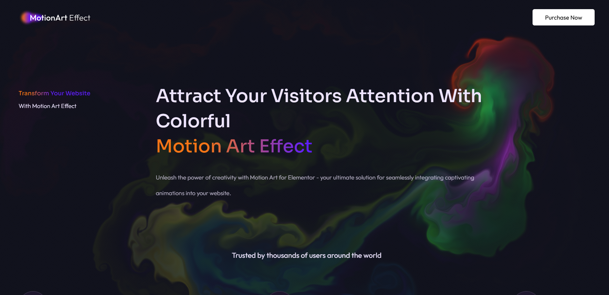

# Motion Art 💥

Motion Art is an example of how amazing UI can be made using WebGL.
---

## Demo

You can checkout the project here : https://motion-art-c4.vercel.app/

## Features ✨

- **Motion:** Mouse movements trigger interactive designs in the UI.

---

## Screenshots 🌟

### Home Page


## Tech Stack 🛠️

- **Frontend:** React for interactive UI, WebGL.

---

## Installation & Setup 🚀

1. Clone the repository:
   ```bash
   git clone https://github.com/VibekRoy/motion-art.git
   cd motion-art
   ```

2. Set up the frontend:
   ```bash
   npm install
   ```

5. Start the frontend:
   ```bash
   npm run dev
   ```
---

## Contributing 🤝

Contributions are welcome! Feel free to fork the repo and submit pull requests.  

---

## Contact 📬

For any queries, feel free to reach out:  
- **Author:** Vibek Roy  
- **Email:** vibekroy321@gmail.com
- **GitHub:** [VibekRoy](https://github.com/VibekRoy)
